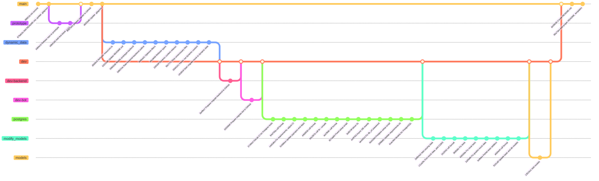

## Development
### Kanban board
[link](https://github.com/orgs/team-42-daha/projects/3/views/1)
#### Entry criteria
##### To Do
- The issue was updated (e.g., via an LLM) to conform to the type "Task" issue form template
- The type "Task" was assigned to the issue
- Relevant labels were assigned to the issue
- The issue was made a sub-issue of a type "Backlog" issue
##### In Progress
- The issue description was revised to provide missing details
- The issue field "Ideal Hours" was filled in
- The issue was added to the current sprint
- The issue was assigned
- If necessary, a branch for the issue was created via the "create a branch" button on the issue page
##### Ready For Review
- A pull request for the issue was created using a relevant template
- Implementation in the pull request was completed
- CI pipeline with automated tests succeeded on the pull request branch
- All sections in the pull request description were updated to match implementation
- A review of the pull request was requested
##### Ready To Merge
- All acceptance criteria specified in the issue were met on the pull request branch
- The pull request was approved
##### Done
- The pull request was merged into the target branch
- If no pull request was required to complete the issue: All acceptance criteria specified in the issue were met

### Git workflow
Based on [GitHub Flow](https://docs.github.com/en/get-started/using-github/github-flow)

#### Creating issues
Issues are created using pre-defined templates:
- [bug report template](.github/ISSUE_TEMPLATE/bug-report-template.md)
- [technical task template](.github/ISSUE_TEMPLATE/tech-task-template.md)
- [user story template](.github/ISSUE_TEMPLATE/user-story-template.md)

Each issue must correspond to a template. Otherwise, a new template must be created (only after discussion with all project members).

#### Labeling issues
Each issue by default has a type (Backlog or Task).
Backlog issues must have label corresponding to its actual type (User Story or Bug)
Tech Tasks must have labels showing`` their relation to technical parts of the project (Frontend, Backend, Database, TG-bot).

#### Assigning issues to team members
Issues are assigned to team members depending on their hard skills and free time. There should not be a situation where all issues are assigned to the same team member.

#### Creating, naming, merging branches
New branches are created for each major feature added to the project. Branch names must reflect their purpose, be short, and written in `snake_case`.  
Merging branches is allowed only after creating a proper pull request and reviewing it.

#### Commit messages format
Commit messages must be short and descriptive. There must be a single commit per any significant code change. Commits should be written in the infinitive form of the verb (e.g., “fix a typo” or “change the code for asynchronous operation”).

#### Creating a pull request
Pull requests are created using a pre-defined template:
- [pull request template](.github/PULL_REQUEST_TEMPLATE.md)

#### Code reviews
Each pull request must be reviewed before approval. Reviews are assigned to a team member with the corresponding technical skills.  
Self-reviewing is strictly prohibited. Reviews must contain comments and suggestions.

#### Merging pull requests
Pull requests can be approved only after a code review. Each pull request must be made from a specific branch and contain major features.

#### Resolving issues
Resolving issues depends on their type:
- User Stories can be marked as resolved only after creating all corresponding functionality and testing acceptance criteria.
- Tech Tasks can be marked as resolved only after completing the task with all subtasks and merging changes into the stable branch.
- Bugs can be marked as resolved only after fixing the bug and merging changes into the stable branch.

#### Git graph diagram
TODO: extend later

### Secrets management
We follow strict practices to manage and protect secrets such as API keys, database credentials, and other sensitive configuration values:
- For local setups, all sensitive information must be stored in environment variables (`.env` file added to `.gitignore`), so that they are never hardcoded in the source code or committed to version control.
- For production setups, environment variables are set and managed securely at the system level (e.g., through systemd service files), ensuring they’re never exposed in logs or accessible to the public.

## Quality assurance

### Quality attribute scenarios
[link](docs/quality-assurance/quality-attribute-scenarios.md)

### Automated tests
- **Tools Used for Testing:**\
The project uses `pytest` along with `pytest-asyncio` for asynchronous test execution. HTTP requests are performed using `httpx.AsyncClient`, and PostgreSQL test databases are managed with `pytest-postgresql`. `SQLAlchemy` and `SQLModel` are used for ORM and session handling.
- **Types of Tests Implemented**:
    - Integration tests for different API endpoints:
      - CRUD operations for courses, subjects, grades, difficulties, and organizations.
      - Validation of relationships (e.g. courses with multiple subjects and grades).
      - Error handling for not found resources or invalid inputs.
    - Unit tests:
        - TBD
- **Test locations:**\
All tests are located in `backend/app/core/test_router.py`

## Build and deployment

### Continuous Integration
- [Backend workflow](.github/workflows/backend.yml)
  - Static analysis tools:
    - **Ruff**\
      Used to perform static code analysis on Python files to enforce code style, check formatting, and catch common programming errors.
  - Testing Tools
    - **pytest**\
      Used to run automated test cases in the Python backend.
- Frontend workflow:
    - TBD
### Continuous Deployment
*TBD*

## Architecture

### Static view

#### Coupling and cohesion
*TBD when codebase is ready, for now we can't specify cohesion and coupling*

#### Maintainability
*TBD when coupling and cohesion levels are defined*

### Dynamic view

#### Test report for "admin adds a course and user gets notification scenario"
*TBD when codebase is ready*

### Deployment view

#### Deployment Choices
The Daha platform is deployed on a single VPS running Ubuntu, with all core services hosted together:
- Frontend (Vite-built static assets) served via Nginx on `https://daha.pro`
- Backend (FastAPI + Uvicorn) exposed at `https://api.daha.pro`
- PostgreSQL runs locally on the same VPS
- Telegram Bot runs as a background service and listens on a public webhook
- Reverse proxy (Nginx) routes HTTPS traffic to the correct internal services
- Let's Encrypt provides SSL certificates for secure connections
- All services are managed with systemd, ensuring automatic startup and recovery

Such a setup was chosen because of its simplicity. It is suitable for MVPs and can be changed after the product release to ensure greater stability and security.

#### Customer-side Deployment
For the current setup, the customer needs a Linux-based VPS or another type of server having/supporting the following:
- Public IP address (for public access and domain binding)
- Python environment (for FastAPI + bot)
- Node.js (for frontend build and Vite)
- PostgreSQL (as data storage)
- Nginx (or similar utility with reverse proxy functionality)
- systemd (for creating services that can be used to manage all components)
