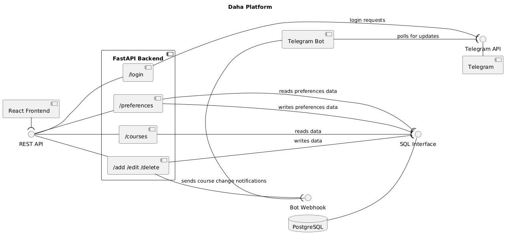
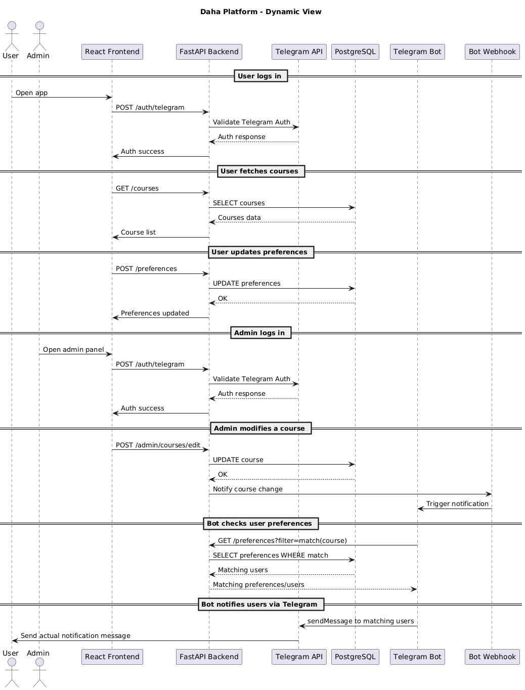
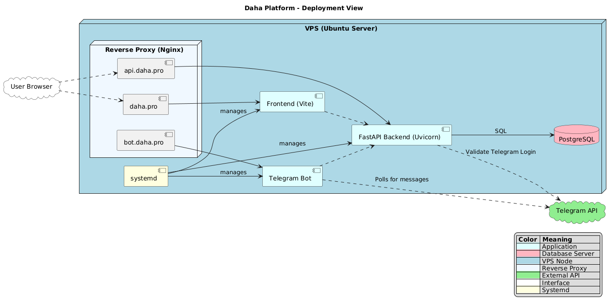

## Development

### Project Structure
The Daha platform consists of four main components:
- **Frontend** (`frontend/`) - React application with Vite
- **Backend** (`backend/`) - FastAPI REST API
- **Bot** (`bot/`) - Telegram bot for course notifications
- **Documentation** (`docs/`) - Architecture and quality assurance docs

### Kanban board
*TBD*

### Git workflow
Based on [GitHub Flow](https://docs.github.com/en/get-started/using-github/github-flow)

#### Creating issues
Issues are created using pre-defined templates:
- [bug report template](.github/ISSUE_TEMPLATE/bug-report-template.md)
- [technical task template](.github/ISSUE_TEMPLATE/tech-task-template.md)
- [user story template](.github/ISSUE_TEMPLATE/user-story-template.md)

Each issue must correspond to a template. Otherwise, a new template must be created (only after discussion with all project members).

#### Labeling issues
Each issue by default has a type (User Story, Tech Task, or Bug).  
Additionally, User Stories and Tech Tasks must have labels corresponding to their priority level (High, Medium, or Low).  
Also, Tech Tasks must have labels showing their relation to technical parts of the project (Frontend, Backend, TG-bot).

#### Assigning issues to team members
Issues are assigned to team members depending on their hard skills and free time. There should not be a situation where all issues are assigned to the same team member.

#### Creating, naming, merging branches
New branches are created for each major feature added to the project. Branch names must reflect their purpose, be short, and written in `snake_case`.  
Merging branches is allowed only after creating a proper pull request and reviewing it.

#### Commit messages format
Commit messages must be short and descriptive. There must be a single commit per any significant code change. Commits should be written in the infinitive form of the verb (e.g., “fix a typo” or “change the code for asynchronous operation”).

#### Creating a pull request
Pull requests are created using a pre-defined template:
- [pull request template](.github/PULL_REQUEST_TEMPLATE.md)

#### Code reviews
Each pull request must be reviewed before approval. Reviews are assigned to a team member with the corresponding technical skills.  
Self-reviewing is strictly prohibited. Reviews must contain comments and suggestions.

#### Merging pull requests
Pull requests can be approved only after a code review. Each pull request must be made from a specific branch and contain major features.

#### Resolving issues
Resolving issues depends on their type:
- User Stories can be marked as resolved only after creating all corresponding functionality and testing acceptance criteria.
- Tech Tasks can be marked as resolved only after completing the task with all subtasks and merging changes into the stable branch.
- Bugs can be marked as resolved only after fixing the bug and merging changes into the stable branch.

#### Gitgraph diagram
*TBD when workflow is applied*

### Secrets management
We follow strict practices to manage and protect secrets such as API keys, database credentials, and other sensitive configuration values:
- For local setups, all sensitive information must be stored in environment variables (`.env` file added to `.gitignore`), so that they are never hardcoded in the source code or committed to version control.
- For production setups, environment variables are set and managed securely at the system level (e.g., through systemd service files), ensuring they’re never exposed in logs or accessible to the public.

## Quality assurance

### Quality attribute scenarios
[link](docs/quality-assurance/quality-attribute-scenarios.md)

### Automated tests
*TBD*

## Build and deployment

### Continuous Integration
*TBD*

### Continuous Deployment
*TBD*

## Architecture

### Static view

#### Coupling and cohesion
*TBD when codebase is ready, for now we can't specify cohesion and coupling*

#### Maintainability
*TBD when coupling and cohesion levels are defined*

### Dynamic view

#### Test report for "admin adds a course and user gets notification scenario"
*TBD when codebase is ready*

### Deployment view

#### Deployment Choices
The Daha platform is deployed on a single VPS running Ubuntu, with all core services hosted together:
- Frontend (Vite-built static assets) served via Nginx on `https://daha.pro`
- Backend (FastAPI + Uvicorn) exposed at `https://api.daha.pro`
- Bot (FastAPI + aiogram) exposed at `https://bot.daha.pro`
- PostgreSQL runs locally on the same VPS
- Telegram Bot runs as a background service and listens on a public webhook
- Reverse proxy (Nginx) routes HTTPS traffic to the correct internal services
- Let's Encrypt provides SSL certificates for secure connections
- All services are managed with systemd, ensuring automatic startup and recovery

Such a setup was chosen because of its simplicity. It is suitable for MVPs and can be changed after the product release to ensure greater stability and security.

#### Customer-side Deployment
For the current setup, the customer needs a Linux-based VPS or another type of server having/supporting the following:
- Public IP address (for public access and domain binding)
- Python environment (for FastAPI + bot)
- Node.js (for frontend build and Vite)
- PostgreSQL (as data storage)
- Nginx (or similar utility with reverse proxy functionality)
- systemd (for creating services that can be used to manage all components)
